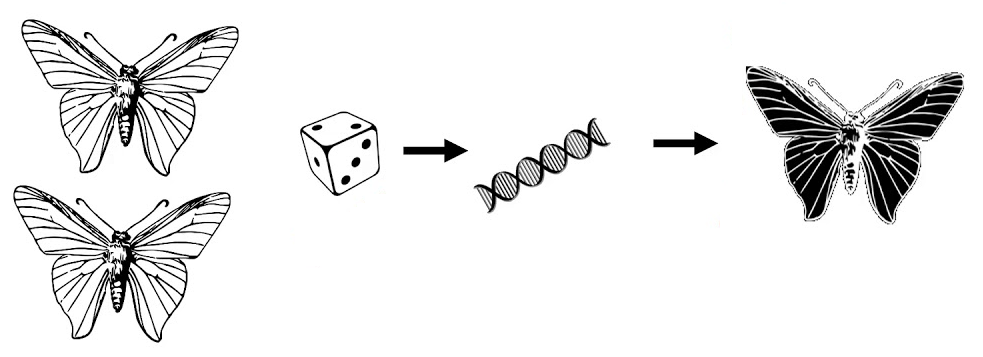
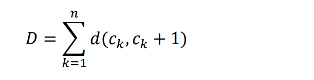
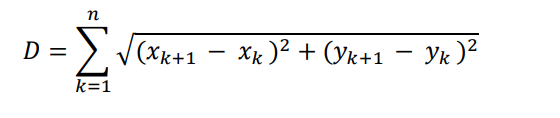
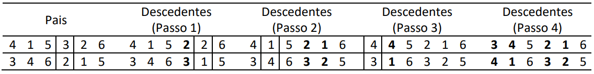

# Trabalho Algoritmos Genéticos

#### Alunos: Arthur Bizon, Gabriel Schneider e Luciane Tedesco

Este trabalho discute a implementação do algoritmo genético baseado no caso do Caixeiro Viajante.

Assumimos que há um caixeiro-viajante que precisa visitar n cidades através do caminho mais curto
possível. Ele visita cada cidade exatamente uma vez, em seguida, retorna para a cidade onde ele
começou. Portanto, uma solução seria uma lista de todas as cidades na ordem que ele as visita: como
Cidade 1, Cidade 2,..., Cidade n; onde a cidade 1 é o seu estado inicial. Assim, os cromossomos para o
algoritmo genético serão diferentes permutações dos números inteiros de 1 a n.

Há muitas variações do problema caixeiro-viajante, mas para este trabalho faremos as seguintes
suposições:
- Cidades: Representadas por cromossomos, são números inteiros de 1 a 20.
- As n cidades serão listados na ordem c1 → c2 → ... → cn num dado cromossomo. 
- Coordenadas: Consideramos 20 cidades com coordenadas representadas por números aleatórios entre (0,0) e (1,1) em um plano cartesiano.
- Partindo do princípio que estamos tentando minimizar a distância total que o caixeiro viajante percorre, a função de aptdão será a distância total D:

- A cidade n+1 = Cidade 1 (estado inicial). Se (xi, yi) são as coordenadas da cidade ci, logo, a função de aptidão (fitness) é dada pela distância euclidiana:

- Assumimos que a distância d da cidade ci para a cidade cj é: d (ci, cj) = d (cj, ci) para todo i ∈
[1, n] e j ∈ [1, n]. 
- O tamanho da população é 20 e o número de interações é 10.000.
- Para construir as gerações subsequentes, mantemos a metade da população atual e geramos a outra metade da nova geração por meio da seleção e do crossover, mantendo apenas parte da população.
- Para determinar a distribuição do conjunto de cromossomos que serão escolhidos para a reprodução, calculamos a probabilidade, na qual distribuimos os valores inversamente (visto que organizamos os cromossomos em ordem crescente do mais apto ao menos apto).
- Para selecionar os cromossomo, utilizamos o método da roleta.
- Como no nosso caso o agente visita somente uma vez cada cidade, utilizaremos para fazer a Recombinação (crossover) a técnica de “cycle” (exemplo na Figura 1), onde:
    - Escolhemos um local aleatório dentro do cromossomo.
    - Passo 1: Os dois cromossomos pais trocam os números inteiros neste local para gerar os descendentes. A menos que os           números trocados tenham o mesmo valor, cada descendente terá um número duplicado.
    - Passo 2: Em seguida, mudamos o número duplicado da primeira descendência com o mesmo local do número da segunda               descendência.
    - Passo 3 e 4: Isto significa que temos agora outro número duplicado então, repitiremos este processo até não terem mais       números duplicados.

Exemplo de Recombinação Cycle:
 

- O operador de mutação escolhe aleatoriamente dois números inteiros em um cromossomo da nova geração e os troca. O operador de mutação atua sobre cada membro da nova geração com probabilidade de 0,05

### Desenvolvimento:
[Aqui](src/Documentacao.html) você encontra a documentação dos métodos criados.
